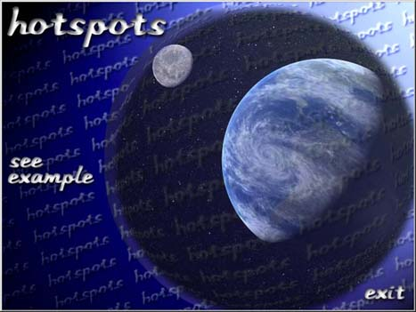



## Hotspots and Custom Buttons

### Description

Hotspots part1.

(Basic Hotspots)

This program will show new users of Visual Basic how to create hotspots and custom buttons using the image control.

See how variable arrays can be used to switch graphics on a single image control.

See how you can use control arrays with different graphics. Use a shape control to identify the screen location for your hotspots.

You will see how to make custom buttons using graphics and the image control.

And finally, you will see the underlying thought process on how an "Interactive Multimedia" program is built in VB.

As always, your comments and votes keep these examples coming. Please take a minute to tell me what you think.
 
### More Info
 
Have Fun

             |
---                |---
**Submitted On**   |2000-04-23 22:43:02
**By**             |[AlexHogan](https://github.com/Planet-Source-Code/PSCIndex/blob/master/ByAuthor/alexhogan.md)
**Level**          |Beginner
**User Rating**    |4.9 (44 globes from 9 users)
**Compatibility**  |VB 5\.0, VB 6\.0
**Category**       |[Custom Controls/ Forms/  Menus](https://github.com/Planet-Source-Code/PSCIndex/blob/master/ByCategory/custom-controls-forms-menus__1-4.md)
**World**          |[Visual Basic](https://github.com/Planet-Source-Code/PSCIndex/blob/master/ByWorld/visual-basic.md)
**Archive File**   |[CODE\_UPLOAD51414232000\.zip](https://github.com/Planet-Source-Code/alexhogan-hotspots-and-custom-buttons__1-7537/archive/master.zip)

